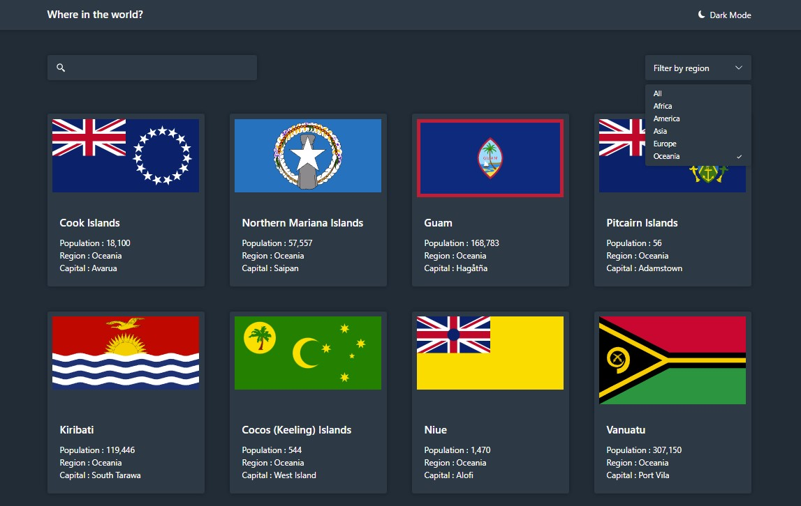
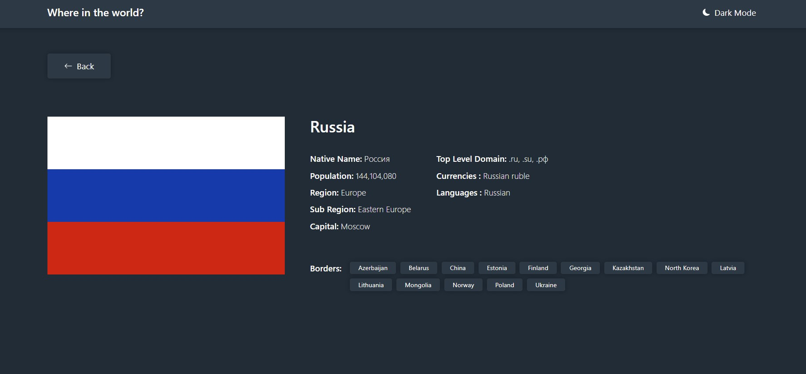

# REST Countries
The react applicatio Displays information about all the countries in the world.
On clicking the individual country provides more information on it. Search through the countries.
All the data for the countries is provided by an External API.

### External API
- [@REST_Countries](https://restcountries.com)
### Author

- [@prajwalgautam](https://www.github.com/prajwal18)

## Features

- Displays the data for All the countries in the world.
- Search for specific country.
- Individual pages for all the countries.
- Desktop and Mobile View.

## Demo
#### Home Page (All Countries)

#### Individual Country (Russia)

## Live Preview
[@Click Me](https://prajwal18.github.io/REST-API-World-Info/) To Visit the website.